---
# ORACLE Cloud-Native DevOps workshop #

## Build Spring Boot container packaged application using Wercker and deploy to Oracle Container Cloud Service ##

### About this tutorial ###
**Wercker** is a Docker-Native CI/CD  Automation platform for Kubernetes & Microservice Deployments. Wercker is integrated with Docker containers, which package up application code and can be easily moved from server to server. Each build artifact can be a Docker container. The user can take the container from the Docker Hub or his private registry and build the code before shipping it. Its SaaS platform enables developers to test and deploy code often. They can push software updates incrementally as they are ready, rather than in bundled dumps. It makes it easier for coders to practice continuous integration, a software engineering practice in which each change a developer makes to the codebase is constantly tested in the process so that software doesn’t break when it goes live.

Wercker is based on the concept of pipelines, which are automated workflows. Pipelines take pieces of code and automatically execute a series of steps upon that code. The Wercker API provides programmatic access to information about applications, builds and deploys. There are code snippets available for Golang, Node.js and Python.

**Oracle Container Cloud Service** provides an easy and quick way to create an enterprise-grade container infrastructure. It delivers comprehensive tooling to compose, deploy, orchestrate and manage Docker container-based applications on the Oracle Public Cloud. It is designed to provision a ready to run containerized infrastructure quickly, that can be used as a test infrastructure, with a limited lifespan, or operated as a production environment for long running container applications.

Oracle Container Cloud Service supports running Docker containers and images, and associated technologies such as *Docker Compose*.

**Architecture**

The key components of Wercker:

+ **Step** is self-contained bash script or compiled binary for accomplishing specific automation tasks.
+ **Pipelines** are a series of steps that are triggered on a git push or the completion of another pipeline.
+ **Workflows** are a set of chained and branched pipelines that allow you to form multi-stage, multi-branch complex CI/CD flows that take your project from code to production. 
+ All Wercker pipelines execute inside a **Docker container** and every build artefact can be a Docker container.
+ With Wercker you can **push your images to any container registry** public or private such as Docker.

This tutorial demonstrates how to:

- create Wercker application (CI/CD) to build and push Spring Boot sample included image to Docker repository
- deploy containerized Spring Boot application to Oracle Container Cloud Service from Docker registry

### Prerequisites ###

- [Github](https://github.com) account
- [Oracle Public Cloud Service](https://cloud.oracle.com) account including Container Cloud Service
- [Docker](https://cloud.docker.com/) account to have Docker registry.

----

#### Create Oracle Container Cloud Service instance ####

First create Oracle Container Cloud Service. Sign in to [https://cloud.oracle.com/sign-in](https://cloud.oracle.com/sign-in). Select your datacenter then provide the identity domain and credentials. After a successful login you will see your Dashboard. Find the Container tile and click the hamburger icon. In the dropdown menu click **Open Service Console**.

If it is the first time you launch this console then click **Go To Console** button on the Wizard page. Otherwise click immediately the **Create Service** button.

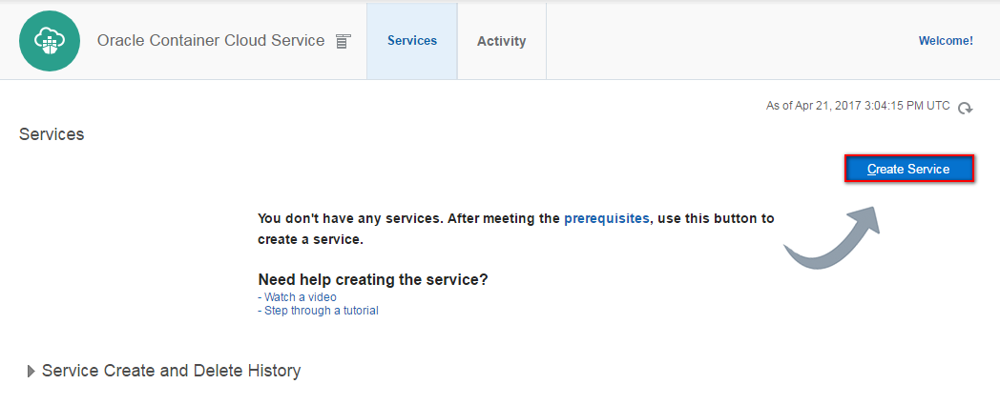

On the details page configure the service.

+ **Service Name**: name of the instance. E.g. *testOCCS*
+ **Description**: short description of the service. Can be anything which describes the purpose of this service.
+ **SSH Public Key**: to connect to the worker and master nodes you need to define your public key of your SSH keypair. Press the **Edit** button. In case if you already have one and you want to use that select the public key file or copy of that content into Key Value textfield. Otherwise and for test purposes I recommend to generate a new one. Select **Create a New Key** option and click **Enter**. A popup dialog will open which enables to download the newly generated key pair. It is important to have this key pair for later usage of this service. In case if you lost or forget where you saved the key pair you can [add new one](https://docs.oracle.com/cloud/latest/computecs_common/OCSUG/GUID-65AA23D4-5F57-4EF6-9704-C8E16932C0AD.htm#OCSUG233) using the My Services Dashboard.
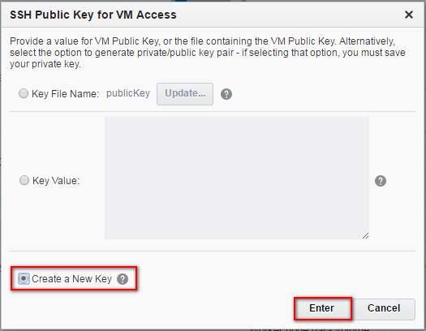
+ **Metering Frequency**: based on your subscription. Leave the default.
+ **Admin Username**: administrator's username of Container Cloud Service's console. You can leave the default.
+ **Admin Password**: administrator's password. Please note the password what you choose.
+ **Worker node Compute Shape**: the capacity of the service. For this sample the minimum is more than enough.
+ **Number of worker nodes**: The number of worker nodes which run the Docker containers. For this sample the default 1 node is enough. One node can execute more containers even if that share one OCPU only. Every worker node has a public IP address assigned what makes the running application publicly available.
+ **Worker node data volume size (GB)**: Leave the default.

Once all the details are configured click **Next**.

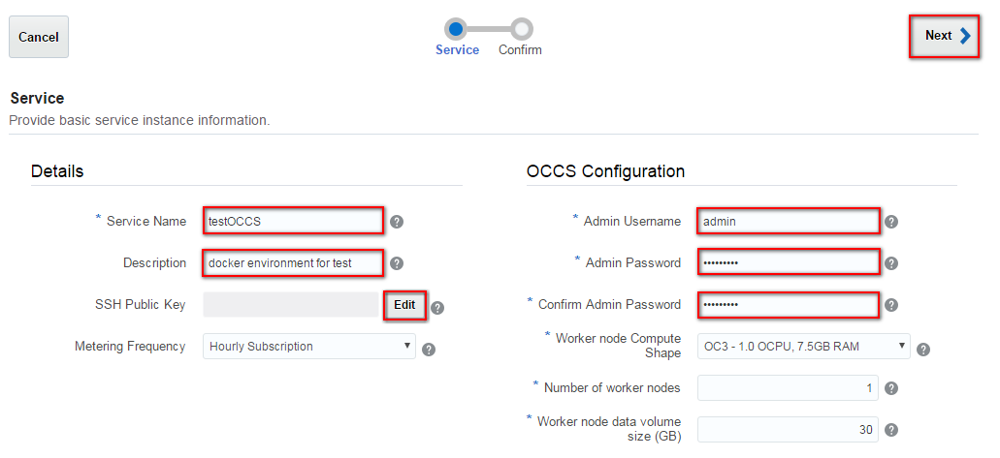

Check again the configuration and submit the instance provision request by clicking **Next**.

While the Container Cloud Service provisioning completes move forward to sign up Docker and create Wercker continous integration setup. 

#### Sign up to Docker ####

If you already have Docker account you can skip this step.

Go to [https://cloud.docker.com/](https://cloud.docker.com/) than choose your *Docker ID* enter your email address and a desired password. Click **Sign up**.

Now check your inbox and you should get a similar email. Click the **Confirm Your Email** button.

You can login now using your new Docker account.

#### Import Spring Boot sample sources into your github repository ####

Sign in to [https://github.com](https://github.com) using your account and select **Import repository**. In case you don't have Github account please [sign up](https://github.com/join?source=header-home).

Enter or copy the *https://github.com/nagypeter/wercker-springboot.git* repository address into old repository's clone URL and use the same repository name for the new one. It will not conflict because the new repository will be available under your account. Leave the repository public. Click **Begin Import** and wait till the import is ready.

#### Sign up to Wercker using your Github account ####

When the import is done go to [https://app.wercker.com](https://app.wercker.com) and sign up using your github account. Click the **LOG IN WITH GITHUB** button.

If you use the same browser where you are already signed in to github then it will go directly to *Authorize application* github page. If not then enter your github's credentials to sign in to github. Click the **Authorize application** button to accept Wercker's request. You can revoke Wercker's authorization request anytime using your github's profile settings.

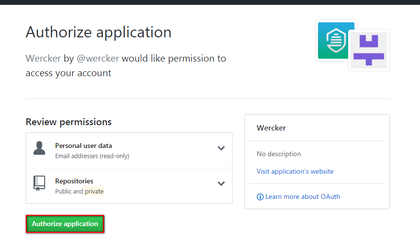

After the successfull authorization you will be redirected to *https://app.wercker.com*.

#### Create Wercker Application to build Docker container including Spring Boot sample application ####

Now here is the time to create your Wercker application. Wercker acts as continuous integration tool which will produce and push a complete Docker container including your Spring Boot sample application.

Go back to the Wercker's welcome page and click **Create your first application** button or the **+Create** dropdown list and select *Application*.

First select the repository you want to use as sources. By default it will show your Github provider and the available repositories. Select *wercker-springboot* and click **Use selected repo**.

In case of private repositories you should define the access method. Since the the sample repository created as public you can leave the default checkout method. Click **Next step**.

Finally you can choose whether your application is public or not. We recommend to leave default which means the application will be private. Click **Finish** to create your application.

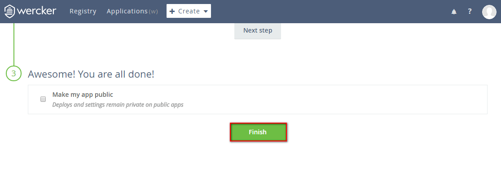

The next page offers to generate specific wercker.yml based on the application's language. This sample application already has one so click the **trigger a build now** link.

Now the default *build* pipeline starts to run which is a simple maven build -defined in *wercker.yml*- of the Spring Boot sample application. The result should be successfull. You can open each step (on the right side) to get more details.

Before you move forward please inspect the *wercker.yml*. The source is available under your github repository. Open a new browser (tab) and go directly to *https://github.com/<YOUR_GITHUB_USERNAME>/wercker-springboot/blob/master/wercker.yml*. Now focus on the first two steps in the configuration what should be the same like below:

	box: combient/java-mvn
	build:
	  steps:
	    # Build Spring Boot Sample application
	    - script:
	        name: Maven install
	        code: mvn install
	push:
	  steps:
	    # Push to public docker repo
	    - internal/docker-push:
	        username: $DOCKER_USERNAME
	        password: $DOCKER_PASSWORD
	        tag: latest
	        repository: $DOCKER_REPOSITORY
	        registry: https://registry.hub.docker.com/v2
	        cmd: java -jar  /pipeline/source/target/springbootdemo-0.0.1.war

The *wercker.yml* defines the configuration of your automation pipelines with a collection of Steps that you wish to execute.
In your *wercker.yml* you can specify any pipeline you like. There is one special pipeline called dev which will only be executed when running it with the CLI using the wercker dev command. Examples of pipeline names: *build-base-container*, *build*, *push-to-registry*.

A pipeline can have its own base box, like in this example the *combient/java-mvn* Docker container. You can use different base boxes per pipeline.

Each pipeline can also specify its own Services. For example, a testing Pipeline may require access to a database server, whereas a deploy pipeline probably wouldn't. This sample has no service.

As you can see in this configuration we have the default pipeline *build* which executes the maven build and a *push* step which is not a reserved pipeline. You will create *push* pipeline in the next step. This is why you couldn't see the Docker push step in the first build.

Please also note the environment variables usage. After the *push* pipeline you will create these variables and set the values.

Now switch to **Workflows** tab.

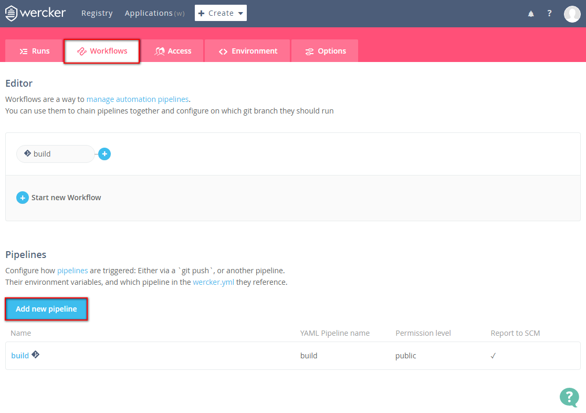

As mentioned upon creating a project in Wercker, it creates a *build* Workflow with a Git hook which executes a build pipeline. This means whenever you push changes into your github repository then a new build will be triggered. Now add a new pipeline what will do the Docker container image push to your Docker registry. Click *Add new pipeline*.

+ **Name**: *push-docker* (but can be anything else)
+ **YML Pipeline name**: it has to be *push*, because we already defined this pipeline in  the *wercker.yml*.
+ **Hook type**: leave default to ignore Git push. You will add this pipeline after build what has already this configuration.

Finally click **Create**.

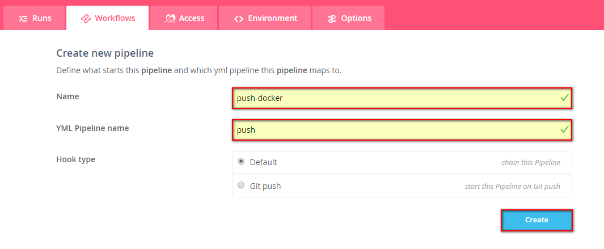

On the detail page of the new *push-docker* pipeline you can immediately add the required environment variables.

+ **DOCKER\_USERNAME** = your Docker username
+ **DOCKER\_PASSWORD** = your Docker password
+ **DOCKER\_REPOSITORY** = <YOUR\_DOCKER\_USERNAME>/wercker-springboot

When you need to add new variable click **Add** button which saves the current row and add a new one. You can use the **Protected** tick box to store safely your value e.g. password.

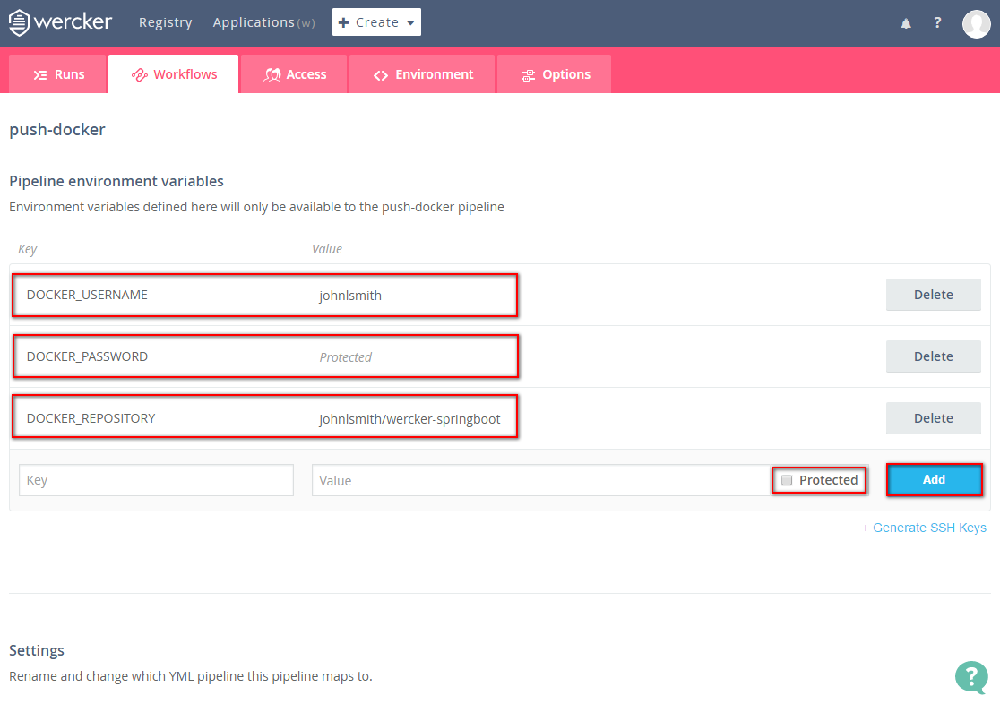

To go back workflow editor click **Workflows** tab again and start to edit your workflow. Click the blue plus icon after the *build* pipeline to add the previosly created *push-docker* pipeline. Leave the default * for branches and select the *push-docker* pipeline from the **Execute pipeline** dropdown list. Click **Add**.

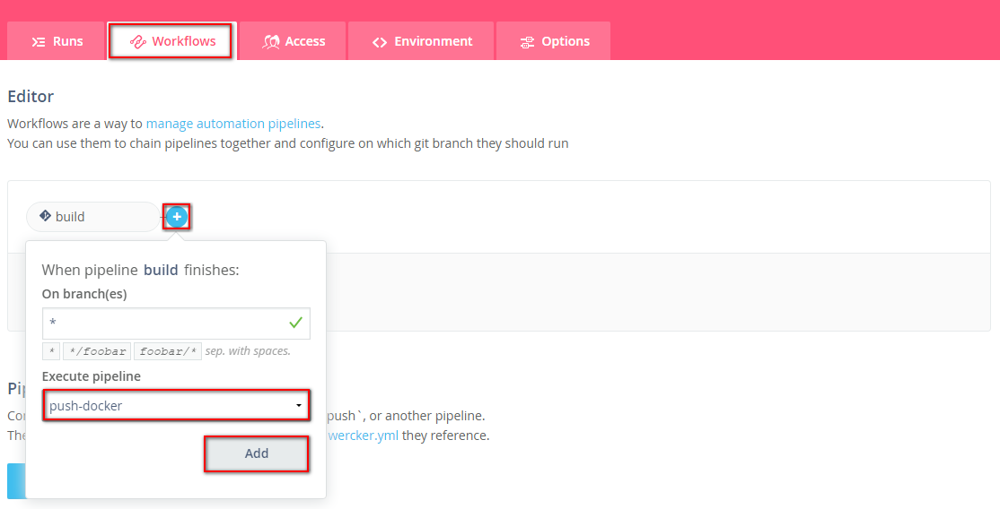

To trigger do some modification on one of the source file in your github repository. Go to the browser (tab) where github.com is opened or open it now. Modify for example the *https://github.com/<YOUR\_GITHUB\_USERNAME>/wercker-springboot/blob/master/src/main/webapp/WEB-INF/views/welcome.jsp* JSP file. Click Edit icon.

Modify the following part:

	 SpringBoot application demo. Current server time: <%= new java.util.Date() %>  

Include your name for example:

	 SpringBoot application demo by JOHN SMITH. Current server time: <%= new java.util.Date() %>  

Enter a commit message and click **Commit changes** button.

It triggers the Wercker build so when you go back to the browser where Wercker is opened you should see the following:

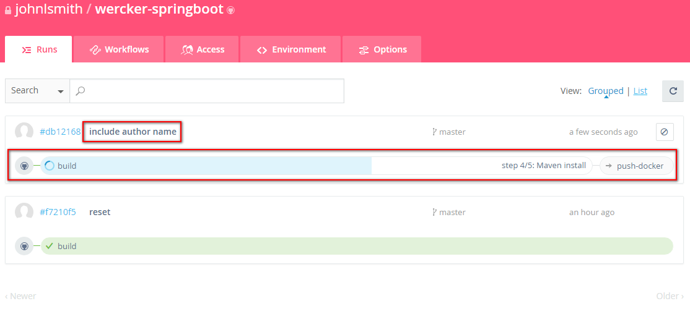

When the build and push-docker is done go back to the browser (tab) where you logged in to [https://cloud.docker.com](https://cloud.docker.com). Click on **Repositories**.

Now you should see a new image called <YOUR\_DOCKER\_USERNAME>/wercker-springboot. This image based on the box defined in *wercker.yml* but Wercker baked the Spring Boot sample application into this image during the workflow. Which results a production ready container.

In the next step you will deploy your new container on Oracle Container Cloud Service using Docker repository.

#### Deploy Spring Boot sample Docker container to Oracle Container Cloud Service ####

Find your browser (tab) where you created Container Cloud Service at the beginning of this lab. If you hit the timeout or lost the browser (tab) then sign in again to [https://cloud.oracle.com/sign-in](https://cloud.oracle.com/sign-in). Select your datacenter then provide the identity domain and credentials. After a successful login you will see your Dashboard. Find the Container tile and click the hamburger icon. In the dropdown menu click **Open Service Console**.

Now you have to see your *testOCCS* (or different if you specified other name) Container Cloud Service instance ready. Click on the hamburger icon on the left and select **Container Console** from the dropdown menu.

Due to the reason that the certification hasn't been setup you will get a security warning. Ignore that and allow to open the page. Enter the Administrator's credential for your Container Cloud Service. If you followed the guide the username has to be *admin*. Click **Login**.

First you need to define your new Service. The new service will comprise all of the necessary configuration for running your Docker container on a host, plus default deployment options. Click **Services** on the left navigation menu than click **New Service** button.

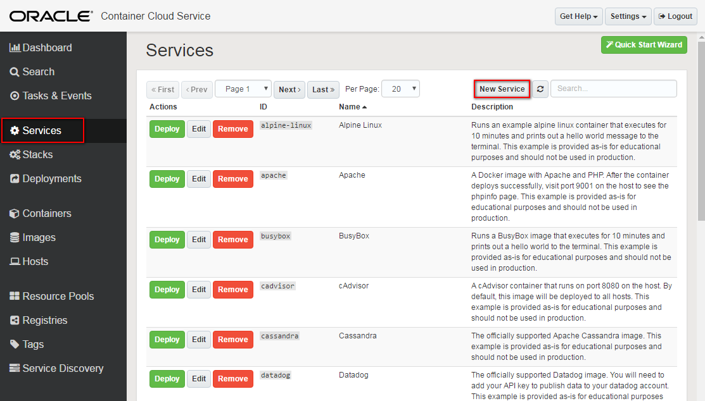

Enter the following parameters to define your new service:

+ **Service Name**: *wercker-springboot* (can be anything)
+ **Service Description**: anything to describe your service.
+ **Image**: *YOUR\_DOCKER\_USERNAME/wercker-springboot* (the name of your Docker image stored in your registry) see previos step when checked your Docker registry.
+ **Ports**: first opt in the Ports on the right side. Then it will populate Ports attribute list.

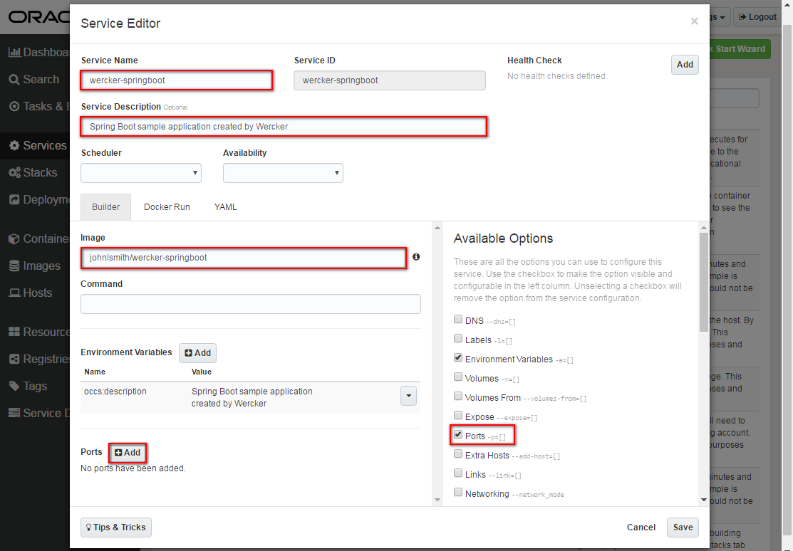

When *Ports* **+Add** button appears click to define port mapping. This port mapping enables internal docker container's port redirection to different port on the host. Spring Boot sample application uses 8080 what you will map to host's 8090 port.

+ **Host Port**: 8090
+ **Container Port**: 8080
+ **Protocol**: TCP

Click **Save**.

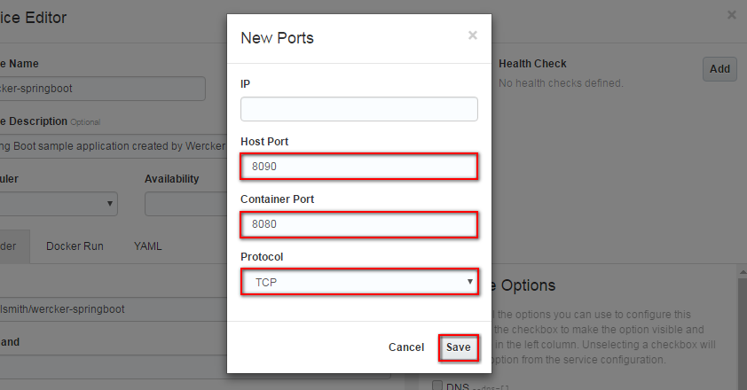

Click **Save** on service details page.

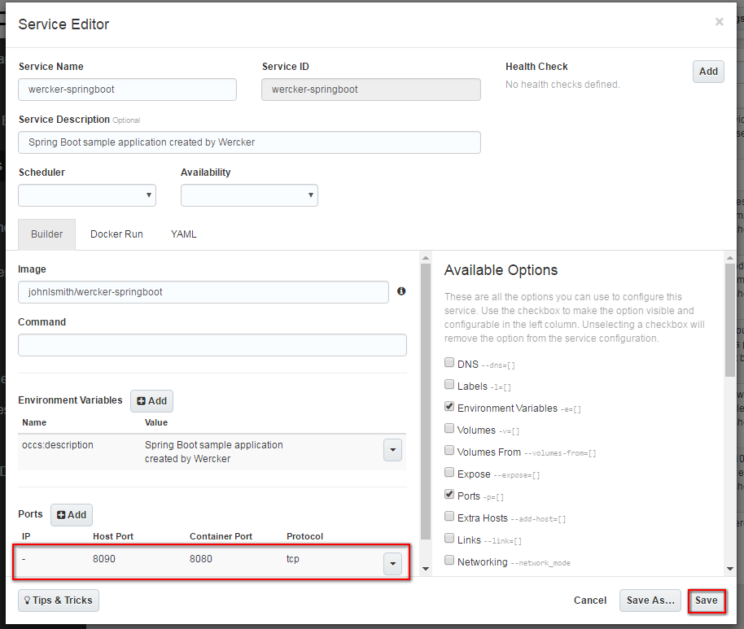

Find your new service in the list. It can happen that you need to jump to the next page of the list. Click on **Deploy** next to your service.

Orchestration can be part of service configuration and you can define during the deployment here. This lab doesn't focus on this so leave default everything except the Deployment Name. It is usefule to add unique name however Container Cloud Service will apppend the deployment date to the name. Click **Deploy**.

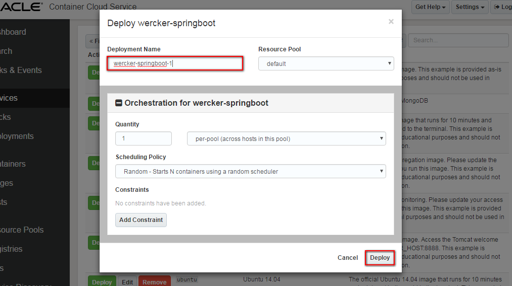

The next page will show the progress of the pull and container startup. If everything went well you should see just one button as Red. Every other should be green! To check the application you need to get the host's public IP address first. Click on the hostname link.

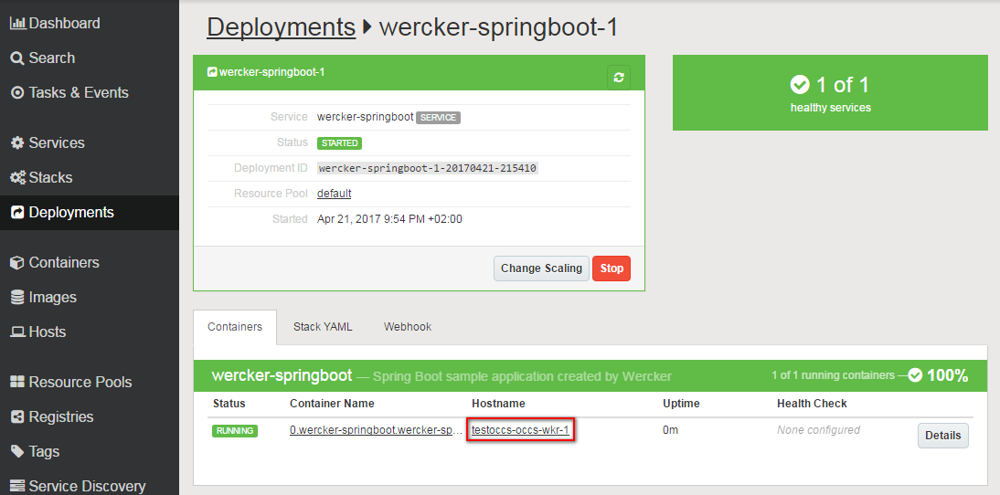

This page shows detailed information and status of the selected host. Find the *public_ip* label and note the IP address next to it.

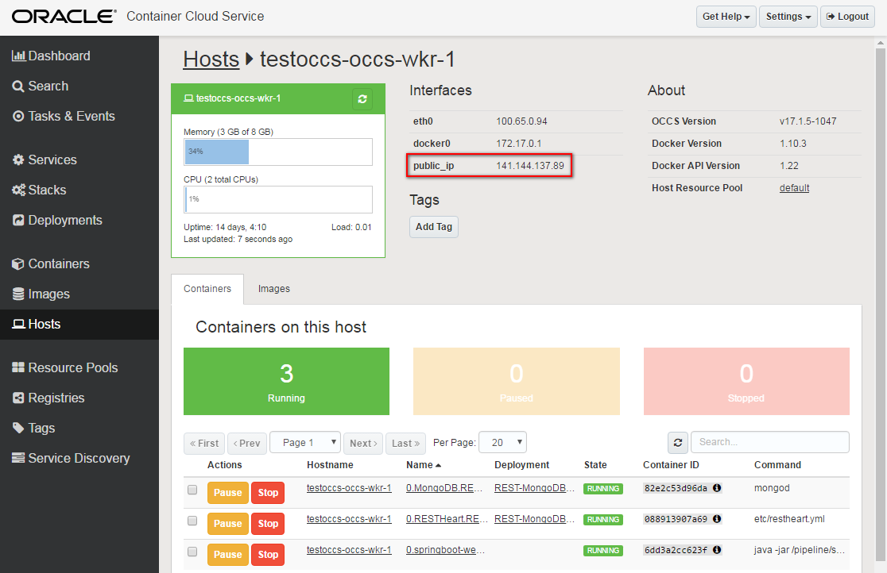

Open a new browser (tab) and enter or copy the host's public IP address and append the 8090 port. For example: `141.144.137.89:8090` You have to get the following webpage:

Please note your name what you inserted on *welcome.jsp* page.

Optionally [add *wercker-occs-container-util* step](wercker.step.occs.md) step to automatically restart Oracle Container Cloud Service when change happens on the application.
